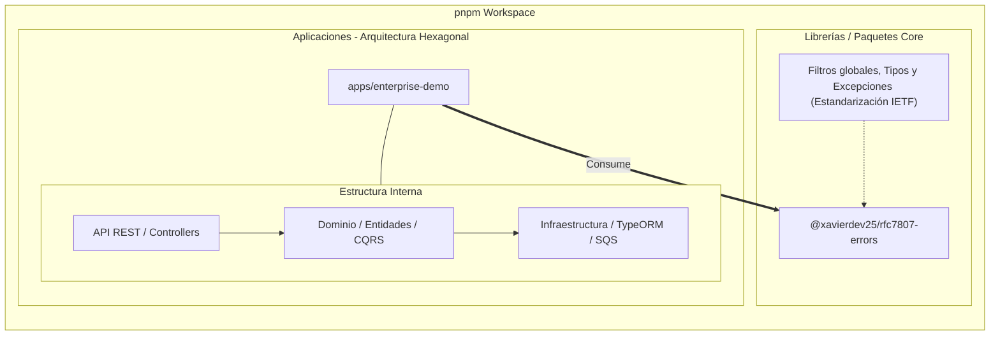

# 🚀 NestJS Enterprise Architecture

Un monorepo robusto, de nivel de producción, diseñado para aplicaciones empresariales escalables. Esta arquitectura resuelve problemas críticos de consistencia de datos, seguridad, rendimiento en alta concurrencia y estandarización de errores mediante patrones de diseño avanzados y herramientas cloud-native.

## 🏗 Arquitectura del Sistema (Monorepo pnpm)

El proyecto está estructurado utilizando **pnpm workspaces**, promoviendo un diseño modular y desacoplado entre las librerías reutilizables y las aplicaciones de dominio.

## 🏆 The "Hero" Sections: Retos de Producción Resueltos

Esta arquitectura se diseñó específicamente para resolver tres de los desafíos más complejos en sistemas distribuidos y empresariales de alto nivel.

### 1. Aislamiento Estricto de Datos (Multi-Tenant RLS) 🛡️

En entornos SaaS B2B, evitar la fuga cruzada de información entre clientes (Tenants) es crítico. Lo mitigamos con **defensa en profundidad de dos capas**: el motor de base de datos y la aplicación.

- **Row Level Security (RLS) en PostgreSQL (capa primaria):** Políticas RLS (`tenant_isolation`) sobre las tablas multi-tenant, provisionadas por migraciones versionadas (ver [`TenantIsolationRls`](apps/enterprise-demo/src/migrations/1719100000001-TenantIsolationRls.ts)). La política filtra cada fila por `tenant_id = get_current_tenant_id()`.

- **Rol de mínimo privilegio + `SET LOCAL ROLE` (la pieza crítica):** PostgreSQL deja que los **superusuarios y el dueño de la tabla** salten RLS — por eso `ENABLE`/`FORCE` por sí solos no bastan. La app ejecuta cada transacción de tenant bajo el rol `rls_app` (`NOSUPERUSER`/`NOBYPASSRLS`) vía `SET LOCAL ROLE`, de modo que las políticas se aplican de verdad. Verificado en el motor: un tenant intentando leer la fila de otro por id obtiene **0 filas**.

- **AsyncLocalStorage (ALS):** El `tenantId`/`userId`/`correlationId` se capturan tras validar el JWT y se propagan por la petición con Node.js ALS, sin contaminar las firmas de método.

- **`TenantAwareEntityManager`:** Abre la transacción, hace `SET LOCAL ROLE rls_app` e inyecta `set_config('app.current_tenant_id', $1, true)` de forma parametrizada y scoped a la transacción.

- **Filtro de aplicación (capa secundaria / belt-and-suspenders):** El repositorio TypeORM **además** filtra explícitamente por `tenantId`; si no hay contexto de tenant, devuelve vacío. Una capa nunca depende ciegamente de la otra.

### 2. Consistencia Eventual Garantizada (Transactional Outbox) 📦

En arquitecturas basadas en eventos, el **Dual-Write Problem** (guardar en base de datos y publicar en una cola de mensajes en pasos separados) puede causar inconsistencias fatales si uno de los dos pasos falla.

- **Outbox Pattern:** En lugar de publicar eventos directamente al bus, interceptamos los eventos de dominio (Ej. `TransactionCreatedEvent`) emitidos por NestJS CQRS y los guardamos en una tabla `outbox_events` de PostgreSQL.

- **Transacciones ACID:** Este guardado ocurre en la **misma transacción de base de datos** que muta el estado principal. O ambos se guardan, o se revierte todo (Rollback).

- **Relay Message Processor:** Un worker asíncrono (`@nestjs/schedule`) sondea los eventos `PENDING`, los despacha a **Amazon SQS** (emulada localmente con `floci`) y los marca `PUBLISHED` solo tras confirmación. Ante un fallo transitorio **no se pierde el evento**: incrementa un contador `attempts` y reintenta en el siguiente tick, marcando `FAILED` únicamente al agotar `MAX_ATTEMPTS` (mensaje envenenado). Si SQS cae, los eventos esperan seguros en PostgreSQL (entrega *at-least-once*).

### 3. Idempotencia Distribuida 🔄

En sistemas de alta concurrencia (ej. procesamiento de pagos), los reintentos automáticos del cliente por fallos de red pueden generar transacciones duplicadas.

- **Interceptor Respaldado por Redis:** Implementamos un mecanismo de protección para todas las operaciones mutables (`POST`, `PATCH`).

- **Header X-Idempotency-Key:** El cliente envía un UUID único por cada intención de operación.

- **Locking & Caching:** Un candado distribuido `SET NX EX` con **token único por adquisición** garantiza exclusión mutua atómica; la liberación usa un script Lua `compare-and-delete`, de modo que un proceso lento nunca borra el candado de otro. Si la llave ya se procesó, el sistema retorna inmediatamente la respuesta cacheada (alcance `idem:{tenantId}:{userId}:{key}`, TTL 24h) sin reejecutar la lógica de negocio.

> **Bonus — Concurrencia optimista:** las transacciones llevan `@VersionColumn`; dos peticiones `process` concurrentes sobre la misma transacción no pueden doble-procesar: la segunda recibe un `409 Conflict` (RFC 7807) en vez de un doble cobro.

---

## ☁️ DevOps & Seguridad Cloud-Native

### Contenedores Multi-Stage y Distroless

Nuestras imágenes Docker están diseñadas con la seguridad y la eficiencia como prioridad absoluta:

- **Build multi-stage + `pnpm deploy`:** Compilamos TypeScript y luego usamos `pnpm deploy --prod` para materializar un `node_modules` plano y **sin `devDependencies`**. (Nota: con pnpm un `prune` simple deja symlinks colgantes que rompen la imagen en distroless — `deploy` lo evita.)

- **Distroless `nonroot`:** El artefacto final corre sobre Google **Distroless** (sin shell, sin gestor de paquetes, sin utilidades del SO, UID 65534), minimizando la superficie de ataque. La imagen arranca y resuelve todas las dependencias de runtime (verificado).

- **Postura de CVEs honesta:** Distroless elimina los CVEs del sistema operativo; las dependencias npm se vigilan con el *gate* de auditoría del CI (ver abajo). Es "superficie mínima", no un literal "cero CVE", que ninguna app con dependencias puede garantizar de forma absoluta.

### Pipeline CI/CD Optimizado

Nuestros flujos de GitHub Actions están optimizados para velocidad y determinismo:

- **`ci.yml` — gates de calidad:** install `--frozen-lockfile`, **escaneo de seguridad** (`pnpm audit --audit-level high`, que **falla** el build ante vulnerabilidades altas/críticas), lint, verificación de formato (Prettier `--check`), tests unitarios con cobertura y **E2E reales** contra servicios `postgres:16-alpine` + `redis:7-alpine` efímeros, y build del monorepo.

- **`build-app.yml` — imagen de producción:** Docker Buildx con caché de capas `type=gha` y target `production` (distroless). El push al registry está deshabilitado por defecto (`push: false`) hasta configurar credenciales.

- **Caché nativa de pnpm:** Recuperación rápida de dependencias en el workspace del monorepo.

### 🗄️ Esquema versionado (Migraciones + RLS)

El esquema **no** se autogenera en producción (`synchronize: false`). Las tablas, índices y **toda la provisión de RLS** (función, rol `rls_app`, políticas, grants) viven en migraciones TypeORM versionadas que corren automáticamente al arrancar (`migrationsRun: true`) y también vía CLI (`pnpm migration:run`). Los tests las ejercitan de cero en cada corrida (`dropSchema` + migraciones).

### ✅ Estado de pruebas (verificado)

- **135** pruebas unitarias en la librería + **135** en la app, en verde.
- **E2E** contra PostgreSQL real, incluyendo un test de **aislamiento cross-tenant** que prueba que un tenant no puede leer datos de otro (y un `401` para no autenticados).
- RLS verificado directamente en el motor bajo el rol `rls_app`: lectura cross-tenant = **0 filas**.
- ESLint y Prettier sin errores.
