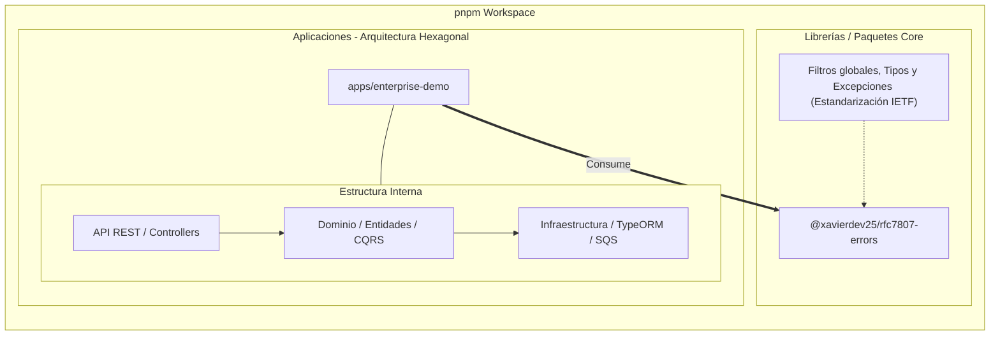

# 🚀 NestJS Enterprise Architecture

Un monorepo robusto, de nivel de producción, diseñado para aplicaciones empresariales escalables. Esta arquitectura resuelve problemas críticos de consistencia de datos, seguridad, rendimiento en alta concurrencia y estandarización de errores mediante patrones de diseño avanzados y herramientas cloud-native.

## 🏗 Arquitectura del Sistema (Monorepo pnpm)

El proyecto está estructurado utilizando **pnpm workspaces**, promoviendo un diseño modular y desacoplado entre las librerías reutilizables y las aplicaciones de dominio.

