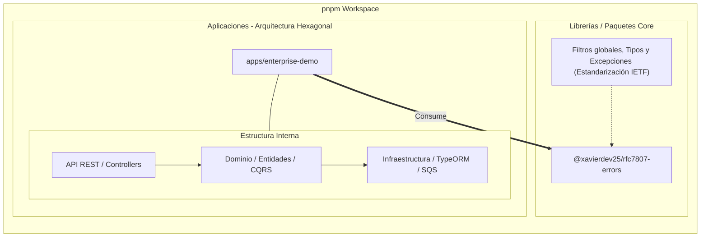

# 🚀 NestJS Enterprise Architecture

Un monorepo robusto, de nivel de producción, diseñado para aplicaciones empresariales escalables. Esta arquitectura resuelve problemas críticos de consistencia de datos, seguridad, rendimiento en alta concurrencia y estandarización de errores mediante patrones de diseño avanzados y herramientas cloud-native.

## 🏗 Arquitectura del Sistema (Monorepo pnpm)

El proyecto está estructurado utilizando **pnpm workspaces**, promoviendo un diseño modular y desacoplado entre las librerías reutilizables y las aplicaciones de dominio.

## 🏆 The "Hero" Sections: Retos de Producción Resueltos

Esta arquitectura se diseñó específicamente para resolver tres de los desafíos más complejos en sistemas distribuidos y empresariales de alto nivel.

### 1. Aislamiento Estricto de Datos (Multi-Tenant RLS) 🛡️

En entornos SaaS B2B, evitar la fuga cruzada de información entre clientes (Tenants) es crítico. Hemos mitigado este riesgo a nivel de base de datos de manera **transparente para el desarrollador**.

- **Row Level Security (RLS) en PostgreSQL:** En lugar de depender de cláusulas `WHERE tenant_id = X` propensas a errores humanos en cada consulta TypeORM, delegamos la seguridad al motor de la base de datos mediante políticas RLS.

- **AsyncLocalStorage (ALS):** Capturamos el `X-Tenant-ID` en el middleware inicial y lo persistimos en el contexto de la petición usando Node.js ALS.

- **TenantAwareEntityManager:** Nuestro EntityManager personalizado de TypeORM intercepta cada transacción e inyecta dinámicamente la configuración en PostgreSQL (`SELECT set_config('app.current_tenant_id', ...)`). De esta manera, incluso una consulta `SELECT * FROM transactions` maliciosa o accidental, solo retornará los datos del Tenant autenticado.

### 2. Consistencia Eventual Garantizada (Transactional Outbox) 📦

En arquitecturas basadas en eventos, el **Dual-Write Problem** (guardar en base de datos y publicar en una cola de mensajes en pasos separados) puede causar inconsistencias fatales si uno de los dos pasos falla.

- **Outbox Pattern:** En lugar de publicar eventos directamente al bus, interceptamos los eventos de dominio (Ej. `TransactionCreatedEvent`) emitidos por NestJS CQRS y los guardamos en una tabla `outbox_events` de PostgreSQL.

- **Transacciones ACID:** Este guardado ocurre en la **misma transacción de base de datos** que muta el estado principal. O ambos se guardan, o se revierte todo (Rollback).

- **Relay Message Processor:** Un worker asíncrono (`@nestjs/schedule`) sondea la tabla en segundo plano y transfiere de manera fiable los eventos a nuestra cola **Amazon SQS** (emulada localmente con `floci`), marcando o eliminando el evento una vez confirmada la entrega. Si SQS cae, los eventos esperan seguros en PostgreSQL.

### 3. Idempotencia Distribuida 🔄

En sistemas de alta concurrencia (ej. procesamiento de pagos), los reintentos automáticos del cliente por fallos de red pueden generar transacciones duplicadas.

- **Interceptor Respaldado por Redis:** Implementamos un mecanismo de protección para todas las operaciones mutables (`POST`, `PATCH`).

- **Header X-Idempotency-Key:** El cliente envía un UUID único por cada intención de operación.

- **Locking & Caching:** Redis verifica la existencia de la llave atómicamente. Si el servidor ya procesó esa llave, el sistema aborta la ejecución y retorna inmediatamente la respuesta almacenada en caché del éxito anterior, salvaguardando la integridad financiera y de datos sin reprocesar la lógica de negocio.

---

## ☁️ DevOps & Seguridad Cloud-Native

### Contenedores Multi-Stage y Distroless

Nuestras imágenes Docker están diseñadas con la seguridad y la eficiencia como prioridad absoluta:

- Utilizamos `multi-stage builds` para compilar TypeScript y aislar las dependencias de desarrollo (`devDependencies`).

- El artefacto final de producción corre sobre imágenes de Google **Distroless** (o `alpine` altamente reducidas), eliminando shells, gestores de paquetes y utilidades del sistema operativo. Esto reduce masivamente la superficie de ataque y nos permite mantener una postura de **Zero CVEs** (Vulnerabilidades).

### Pipeline CI/CD Optimizado

Nuestros flujos de GitHub Actions (`.github/workflows/ci.yml`) están optimizados para la máxima velocidad y determinismo:

- **Caché Nativa de pnpm:** Recuperación instantánea de `node_modules` y cacheo agresivo en el workspace del monorepo.

- **Docker Buildx (`type=gha`):** Cacheo de capas de Docker directamente en el ecosistema de GitHub Actions, reduciendo los tiempos de build de la imagen de producción en un 70%.

- **Entornos Efímeros Completos:** El pipeline levanta servicios reales (`PostgreSQL` y `Redis`) para ejecutar tests End-to-End deterministas, garantizando que el código que se aprueba funcionará en la infraestructura final.
